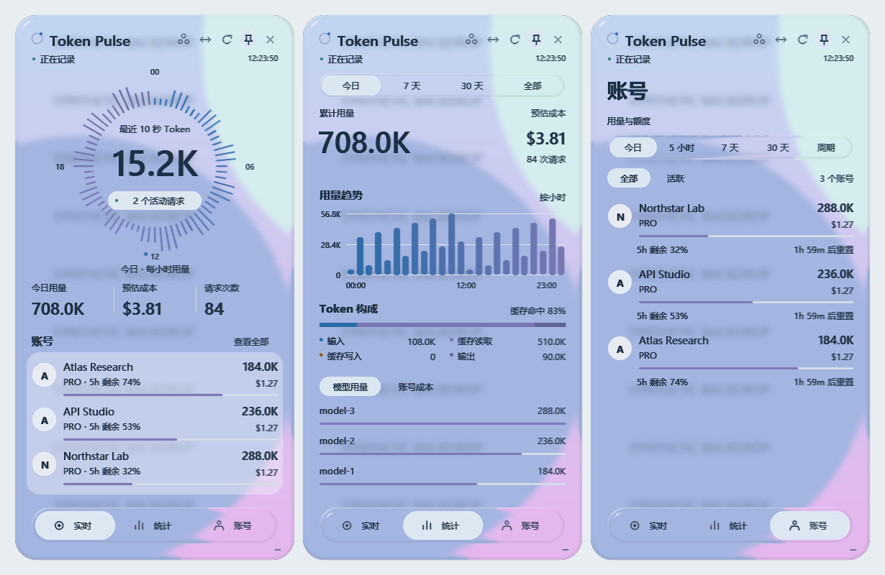
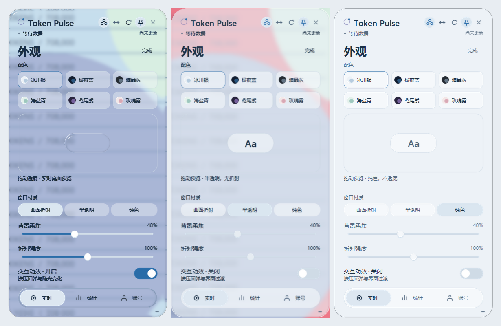

# Orbit 与桌面玻璃材质

Orbit 是适用于竖向悬浮窗的 iOS 风格界面。它使用 Token Pulse 原有的状态、统计、计价、额度窗口和刷新流程。环形时间线按今日每小时用量绘制；中间的数字是最近 10 秒 Token，没有模拟活动数据。

默认窗口为 390 × 760，支持最小 360 × 640。底部导航连接实时、统计与账号页面；右上角可刷新、置顶、调整宽度、打开外观或关闭窗口。



## 使用

```powershell
python -m pip install -r requirements-glass.txt
python monitor.py
```

外观菜单提供冰川银、极夜蓝、烟晶灰、海盐青、鸢尾紫、玫瑰雾六种配色，以及三种窗口材质：

- **曲面折射**：读取窗口后方的真实桌面，绘制柔焦背景、曲面扭曲与清晰高光。
- **半透明**：使用系统兼容材质，不运行 GPU 折射采集线程。
- **纯色**：背景完全不透底，关闭桌面采集和系统背景模糊；圆角外侧仍透明。

选择曲面折射并成功启用后，可以拖动「背景柔焦」和「折射强度」滑杆，窗口与透镜立即同步变化。柔焦范围为 0–100%，默认 40%；折射范围为 0–200%，默认 100%。这两个默认值保留 C 版材质。柔焦只影响背景，不模糊文字或高光；折射强度为 0% 时停止采样位移，保留表面反光。切换其他材质时滑杆停用并保留数值。

设置写入本机 `monitor_appearance.json`，不提交 Git。旧配置自动使用默认参数；数值异常时回退或限制到有效范围。窗口支持 Tab 切换焦点、Enter 操作，滑杆支持左右方向键微调、Home/End 跳到端点，Escape 退出外观页。

“交互动效”控制高光跟随、按压回弹和界面过渡。开启时，小透镜会演示一次回弹；拖动时高光随手势变化，松手后恢复形状。关闭会立即停止并复位这些反馈，仍可拖动透镜查看静态折射，不改变窗口材质或背景柔焦，并遵循 Windows 的客户端动画辅助功能设置。曲面折射预览与窗口共用真实桌面和同一 GPU 材质；背景为空白时变化会更轻微。浏览器中的历史设计对比页独立于桌面版设置。

半透明与纯色材质保留可拖动的 `Aa` 胶囊，用来演示按压形变和回弹；它们不进行曲面采样。动效关闭后胶囊仍能拖动，但按压不会变形。缺少 Pillow 时不显示可拖动预览，基本外观与导航仍可用。



| 设置 | 默认值 | 用途 |
| --- | --- | --- |
| `TOKEN_MONITOR_UI` | `orbit` | `classic` 使用原有界面 |
| `TOKEN_MONITOR_DESKTOP_GLASS` | `1` | `0` 使用不透明界面，关闭桌面材质与采集 |
| `TOKEN_MONITOR_REFRACTION` | `1` | `0` 关闭 GPU 折射，保留兼容的半透明材质 |
| `TOKEN_MONITOR_CAPTURE_MODE` | `windows` | 单独读取背景窗口，悬浮窗仍能在远程画面中看到 |
| `TOKEN_MONITOR_REDUCE_MOTION` | `0` | `1` 关闭界面位移、按压与光感动画 |

这些环境变量需要在启动前设置，也可写入 `.env`。Windows 关闭透明效果、版本低于 Windows 10 1809 或未安装 Pillow 时使用普通 Canvas。缺少 ModernGL、OpenGL 3.3 或 GPU 初始化失败时保留半透明回退；外观页会标记曲面折射未启用。

高级 `TOKEN_MONITOR_CAPTURE_MODE=desktop` 通过 MSS 直接采集桌面，并用 Windows 的捕获排除标记避免采集自身。此模式会使窗口从部分远程桌面或录屏中消失，远程查看应保持默认 `windows`。

## 渲染与兼容边界

这是 Windows 上对曲面玻璃的近似实现，没有调用 Apple 的原生 Liquid Glass API。

1. 独立工作线程按窗口层次读取后方图像，在采集器内部跳过自身；默认不为主窗口设置全局捕获排除。DPI 不感知的背景窗口先按其原生坐标采集，再缩放到设备像素。
2. GPU 先对背景做水平、垂直两次高斯模糊，sigma 默认 4 个逻辑像素，可调至 0–10，随显示缩放换算采样距离。0% 柔焦直接使用原尺寸背景纹理。中心保持柔焦，距边缘约 0.5–5.5 个逻辑像素的区域逐渐恢复折射细节；折射强度缩放采样位移，不改变背景模糊或文字。表面反光独立于背景模糊，以较窄的高光峰和有方向的亮边表现光滑曲面；浅色材质只混入 3% 的配色，保留桌面色彩。
3. 图表、文字与背景分层合成。文字在模糊之后绘制，并按底色提升对比度；不会随桌面背景一起失焦。
4. `UpdateLayeredWindow` 将最终图像呈现到原有 Tk 窗口，拖动、缩放、按钮和刷新仍由原窗口处理。资源在调整尺寸或关闭时释放。

背景图像只保留在内存中，不保存为图片、不进入 Token 用量文件，也不通过网络传出。应用自身的截图接口仅合成界面图层。采集失败时清除当前背景纹理并使用纯色材质，GPU 出错时恢复普通窗口。

`PrintWindow` 对受保护内容、部分视频、透明窗口及窗口阴影的支持有限；无法读取背景时会使用回退材质。实际帧率取决于 GPU、显示缩放以及后方窗口的绘制速度，后台帧处理不会调用 Tk。默认远程可见模式已在 UU 远程中确认窗口可见，但其他远程软件仍应按实际环境检查。

## 验证与构建

```powershell
python -m unittest discover -s tests -p "test_*.py"
```

测试覆盖原有统计边界，以及新界面的导航、周期额度、未定价展示、无依赖回退、文字独立透明度、原生背景采集与 DPI 缩放。GPU 测试在 OpenGL 3.3 可用时编译实际 shader 并检查模糊行为；没有图形上下文时明确跳过。Windows CI 分别运行基础环境和安装玻璃依赖的环境。

`build-windows.ps1` 为主程序收集 glcontext 后端和两个 shader，Windows Release 工作流安装 `requirements-glass.txt`。本地构建前安装 PyInstaller 及这些依赖，其他安装器要求沿用原有流程。

Windows 坐标行为参考：[GetWindowRect 的 DPI 虚拟化](https://learn.microsoft.com/en-us/windows/win32/api/winuser/nf-winuser-getwindowrect)、[查询窗口 DPI 上下文](https://learn.microsoft.com/en-us/windows/win32/api/winuser/nf-winuser-getwindowdpiawarenesscontext)。
